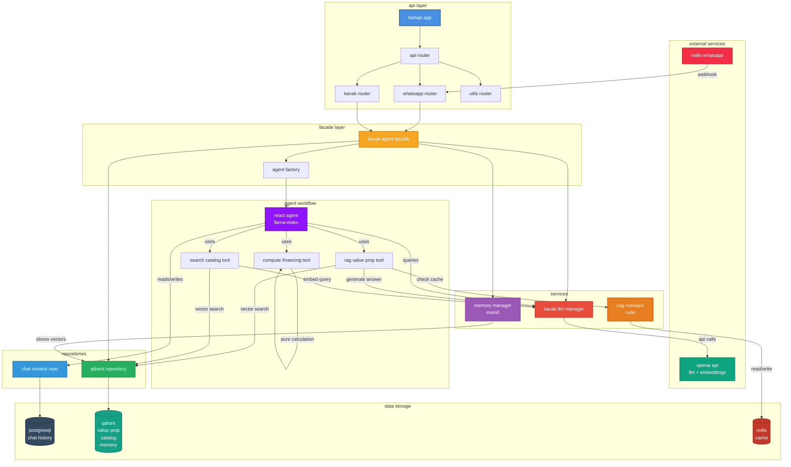

# Agent Architecture Diagram

```mermaid
graph TB
    subgraph external["external services"]
        twilio[twilio whatsapp]
        openai[openai api<br/>llm + embeddings]
    end
    
    subgraph api["api layer"]
        fastapi[fastapi app]
        router[api router]
        whatsapp[whatsapp router]
        kavak_route[kavak router]
        utils[utils router]
    end
    
    subgraph facade["facade layer"]
        facade_comp[kavak agent facade]
        factory[agent factory]
    end
    
    subgraph agent["agent workflow"]
        react[react agent<br/>llama-index]
        
        rag_tool[rag value prop tool]
        catalog_tool[search catalog tool]
        finance_tool[compute financing tool]
    end
    
    subgraph services["services"]
        llm[kavak llm manager]
        memory[memory manager<br/>mem0]
        cache[cag manager<br/>redis]
    end
    
    subgraph repos["repositories"]
        qdrant_repo[qdrant repository]
        pg_repo[chat context repo]
    end
    
    subgraph storage["data storage"]
        pg[(postgresql<br/>chat history)]
        qdrant[(qdrant<br/>value prop<br/>catalog<br/>memory)]
        redis_db[(redis<br/>cache)]
    end
    
    twilio -->|webhook| whatsapp
    fastapi --> router
    router --> whatsapp
    router --> kavak_route
    router --> utils
    
    whatsapp --> facade_comp
    kavak_route --> facade_comp
    
    facade_comp --> factory
    facade_comp --> llm
    facade_comp --> qdrant_repo
    facade_comp --> memory
    
    factory --> react
    
    react -->|uses| rag_tool
    react -->|uses| catalog_tool
    react -->|uses| finance_tool
    react -->|queries| llm
    react -->|reads/writes| pg_repo
    
    rag_tool -->|vector search| qdrant_repo
    rag_tool -->|generate answer| llm
    rag_tool -->|check cache| cache
    
    catalog_tool -->|vector search| qdrant_repo
    catalog_tool -->|embed query| llm
    
    finance_tool -->|pure calculation| finance_tool
    
    llm -->|api calls| openai
    
    memory -->|stores vectors| qdrant_repo
    cache -->|read/write| redis_db
    
    qdrant_repo --> qdrant
    pg_repo --> pg
    
    style fastapi fill:#4a90e2,stroke:#2e5c8a,stroke-width:2px,color:#fff
    style facade_comp fill:#f5a623,stroke:#d68910,stroke-width:2px,color:#fff
    style react fill:#9013fe,stroke:#6a1b9a,stroke-width:2px,color:#fff
    style llm fill:#e74c3c,stroke:#c0392b,stroke-width:2px,color:#fff
    style qdrant_repo fill:#27ae60,stroke:#229954,stroke-width:2px,color:#fff
    style pg_repo fill:#3498db,stroke:#2980b9,stroke-width:2px,color:#fff
    style memory fill:#9b59b6,stroke:#8e44ad,stroke-width:2px,color:#fff
    style cache fill:#e67e22,stroke:#d35400,stroke-width:2px,color:#fff
    style pg fill:#34495e,stroke:#2c3e50,stroke-width:2px,color:#fff
    style qdrant fill:#16a085,stroke:#138d75,stroke-width:2px,color:#fff
    style redis_db fill:#c0392b,stroke:#a93226,stroke-width:2px,color:#fff
    style openai fill:#10a37f,stroke:#0d8c6d,stroke-width:2px,color:#fff
    style twilio fill:#f22f46,stroke:#c91e32,stroke-width:2px,color:#fff
```

