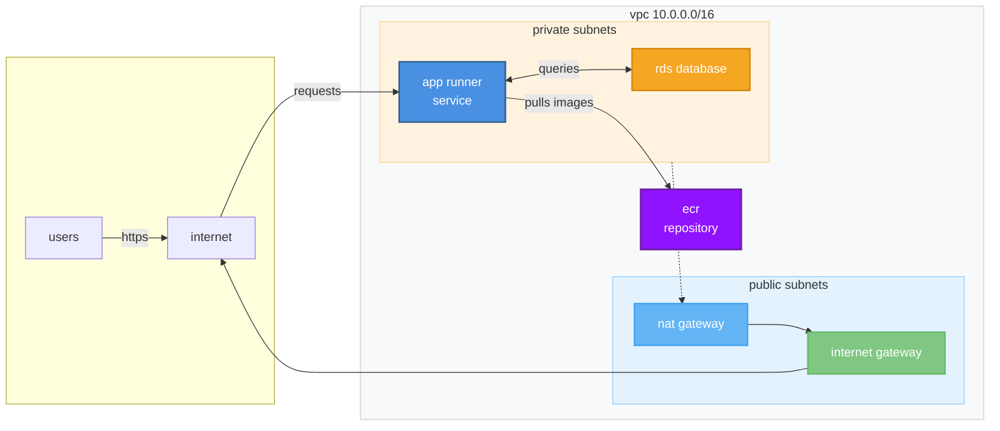

# Infrastructure Diagram

```mermaid
graph LR
    subgraph external[" "]
        users[users]
        internet[internet]
    end
    
    subgraph vpc["vpc 10.0.0.0/16"]
        subgraph public["public subnets"]
            igw[internet gateway]
            nat[nat gateway]
        end
        
        subgraph private["private subnets"]
            app_runner[app runner<br/>service]
            rds[rds database]
        end
        
        ecr[ecr<br/>repository]
    end
    
    users -->|https| internet
    internet -->|requests| app_runner
    app_runner <-->|queries| rds
    app_runner -->|pulls images| ecr
    private -.->|egress| nat
    nat --> igw
    igw --> internet
    
    style app_runner fill:#4a90e2,stroke:#2e5c8a,stroke-width:2px,color:#fff
    style rds fill:#f5a623,stroke:#d68910,stroke-width:2px,color:#fff
    style ecr fill:#9013fe,stroke:#6a1b9a,stroke-width:2px,color:#fff
    style vpc fill:#f8f9fa,stroke:#dee2e6,stroke-width:2px
    style public fill:#e3f2fd,stroke:#90caf9,stroke-width:1px
    style private fill:#fff3e0,stroke:#ffcc80,stroke-width:1px
    style igw fill:#81c784,stroke:#66bb6a,stroke-width:2px,color:#fff
    style nat fill:#64b5f6,stroke:#42a5f5,stroke-width:2px,color:#fff
```
