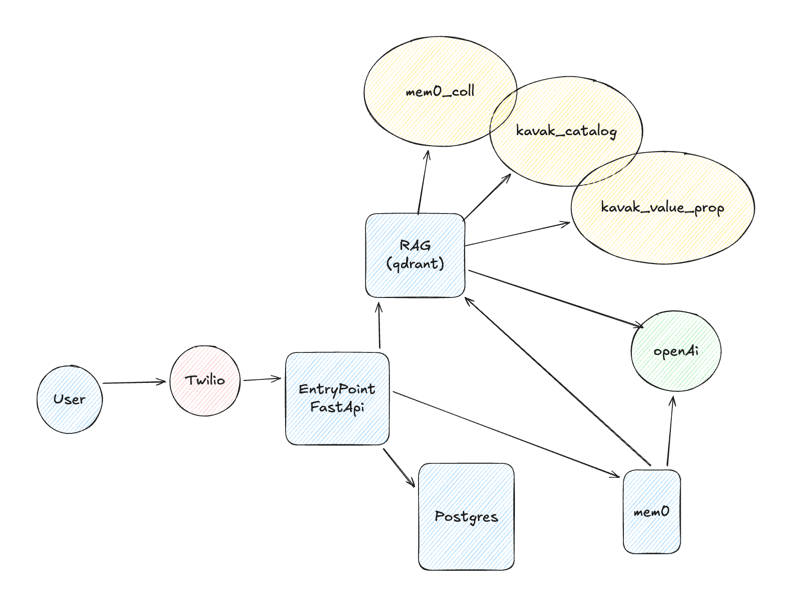
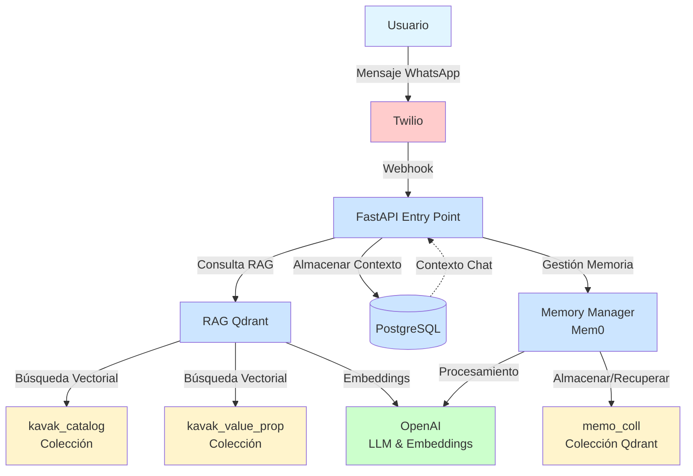

## Draftssss...

### v1 

### v2

### v3 refinado

```mermaid
graph TB
    User[Usuario] -->|Mensaje WhatsApp| Twilio[Twilio]
    Twilio -->|Webhook| FastAPI[FastAPI Entry Point]
    
    FastAPI -->|Consulta RAG| RAG[RAG Qdrant]
    FastAPI -->|Almacenar Contexto| Postgres[(PostgreSQL)]
    FastAPI -->|Gestión Memoria| Mem0[Memory Manager<br/>Mem0]
    
    RAG -->|Búsqueda Vectorial| Catalog[kavak_catalog<br/>Colección]
    RAG -->|Búsqueda Vectorial| ValueProp[kavak_value_prop<br/>Colección]
    RAG -->|Embeddings| OpenAI[OpenAI<br/>LLM & Embeddings]
    
    Mem0 -->|Almacenar/Recuperar| MemoColl[memo_coll<br/>Colección Qdrant]
    Mem0 -->|Procesamiento| OpenAI
    
    Postgres -.->|Contexto Chat| FastAPI
    
    style User fill:#e1f5ff
    style Twilio fill:#ffcccc
    style FastAPI fill:#cce5ff
    style RAG fill:#cce5ff
    style Postgres fill:#cce5ff
    style Mem0 fill:#cce5ff
    style Catalog fill:#fff4cc
    style ValueProp fill:#fff4cc
    style MemoColl fill:#fff4cc
    style OpenAI fill:#ccffcc
```